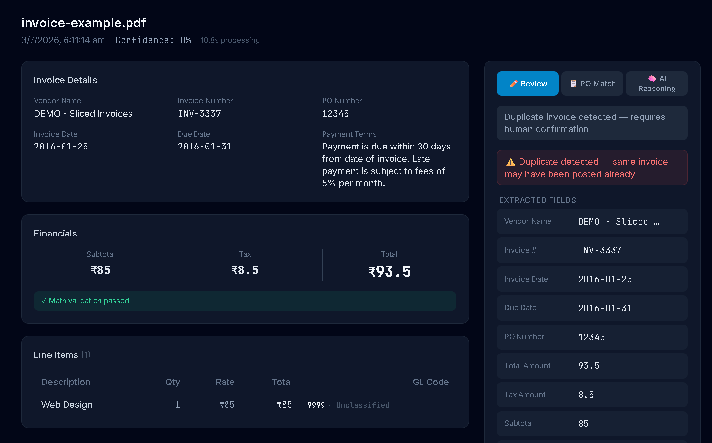
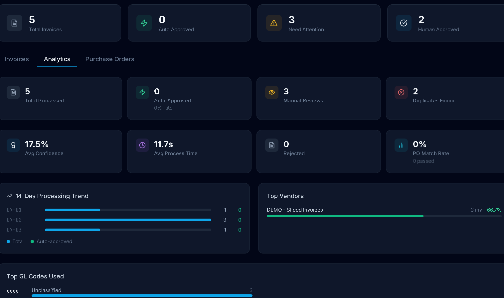
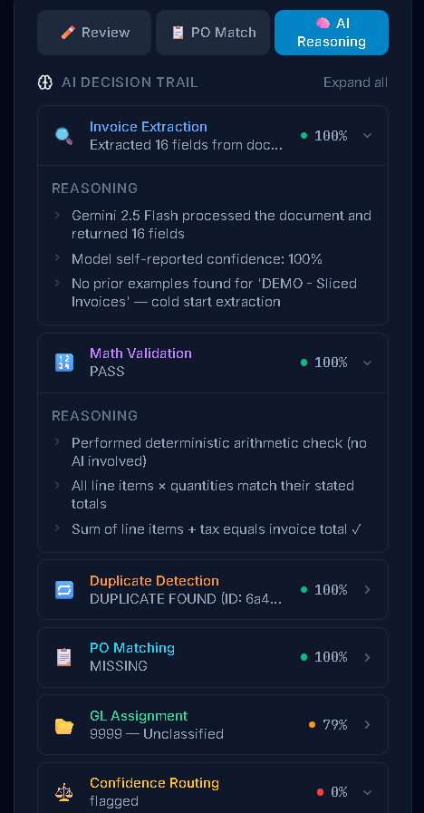

# InvoiceIQ v2 --- AI-Powered Accounts Payable Automation

```{=html}
<p align="center">
```


```{=html}
</p>
```
> **Production-grade AI-powered Accounts Payable Automation System**
> built with **LangGraph, FastAPI, Gemini 2.5 Flash, MongoDB Atlas
> Vector Search, Redis, React, and TailwindCSS**.

InvoiceIQ automates the complete invoice lifecycle---from document
understanding to accounting-ready exports---using an agentic AI workflow
with explainability and continuous learning.

------------------------------------------------------------------------

# Table of Contents

1.  Project Overview
2.  Problem Statement
3.  Solution
4.  Features
5.  Screenshots
6.  Technology Stack
7.  High-Level Architecture
8.  LangGraph Workflow
9.  AI Pipeline
10. Project Structure
11. Database Design
12. API Reference
13. Local Setup
14. Environment Variables
15. MongoDB Atlas Setup
16. Redis Setup
17. Vector Search Setup
18. Example End-to-End Workflow
19. Vendor Memory
20. Explainability
21. Confidence Scoring
22. Performance Optimizations
23. Security Considerations
24. Error Handling
25. Future Roadmap
26. Deployment
27. License

------------------------------------------------------------------------

# Project Overview

InvoiceIQ is an AI-powered invoice processing platform that automates
Accounts Payable workflows.

The system extracts invoice information, validates financial
calculations, detects duplicate invoices, matches purchase orders,
assigns accounting GL codes using semantic search, explains every AI
decision, and routes invoices for automatic approval or human review.

Instead of replacing accountants, InvoiceIQ allows finance teams to
focus only on exceptional invoices while routine invoices are processed
automatically.

------------------------------------------------------------------------

# Problem Statement

Finance teams typically spend hours:

-   Reading invoices manually
-   Entering data into ERP/Tally
-   Checking mathematical calculations
-   Matching Purchase Orders
-   Detecting duplicate invoices
-   Assigning General Ledger codes
-   Reviewing accounting entries

These repetitive processes are expensive, slow, and error-prone.

------------------------------------------------------------------------

# Solution

InvoiceIQ combines:

-   Vision LLMs
-   LangGraph Agent Workflows
-   Deterministic Business Rules
-   Retrieval-Augmented Generation (RAG)
-   Explainable AI
-   Human-in-the-loop Learning

to automate the entire invoice processing pipeline while maintaining
transparency and auditability.

------------------------------------------------------------------------

# Features

## AI Features

-   Vision-based invoice extraction
-   Gemini structured JSON generation
-   Vendor-aware few-shot prompting
-   Explainable AI reasoning
-   Confidence scoring
-   Human feedback learning
-   AI-assisted routing

## Business Features

-   Purchase Order Matching
-   Duplicate Detection
-   Multi-level Math Validation
-   GL Code Assignment
-   Batch Invoice Processing
-   CSV Export
-   JSON Export
-   Analytics Dashboard

## Engineering Features

-   LangGraph orchestration
-   Async FastAPI backend
-   MongoDB Atlas
-   MongoDB Vector Search
-   Redis caching
-   Background processing
-   Modular architecture
-   Typed Pydantic models

------------------------------------------------------------------------

# Screenshots

> Place your screenshots inside the `screenshots/` folder.

## Dashboard

.png)

## Invoice Detail



## Analytics



## Explainability Panel



------------------------------------------------------------------------

# Technology Stack

  Layer             Technology
  ----------------- -----------------------------
  Frontend          React, Vite, TailwindCSS
  Backend           FastAPI
  AI Model          Gemini 2.5 Flash
  Workflow Engine   LangGraph
  Validation        Pydantic
  Database          MongoDB Atlas
  Vector Search     MongoDB Atlas Vector Search
  Cache             Redis
  Embeddings        text-embedding-004

------------------------------------------------------------------------

# High-Level Architecture

``` text
User
 │
 ▼
React Frontend
 │
 ▼
FastAPI Backend
 │
 ▼
LangGraph Workflow
 │
 ├── Gemini
 ├── MongoDB
 ├── Redis
 ├── Vector Search
 └── Business Rules
 │
 ▼
Approval / Human Review
```

------------------------------------------------------------------------

# LangGraph Workflow

``` text
Upload Invoice
      │
      ▼
Extract Invoice
      ▼
Math Validation
      ▼
Duplicate Detection
      ▼
Purchase Order Matching
      ▼
GL Assignment
      ▼
Explainability
      ▼
Confidence Routing
      ▼
Auto Approval / Human Review
      ▼
Learning Loop
```

------------------------------------------------------------------------

# AI Pipeline

## Node 1 -- Invoice Extraction

-   Reads PDF/Image
-   Vendor-aware few-shot prompting
-   Structured JSON output

## Node 2 -- Math Validation

-   Quantity × Unit Price
-   Tax validation
-   Subtotal validation
-   Grand total validation

## Node 3 -- Duplicate Detection

-   Invoice fingerprint
-   Historical invoice lookup

## Node 4 -- Purchase Order Matching

-   Vendor validation
-   Quantity validation
-   Price validation
-   Tax validation
-   Total validation

## Node 5 -- GL Assignment (RAG)

    Invoice Line Item
          ↓
    Embedding
          ↓
    MongoDB Atlas Vector Search
          ↓
    Nearest GL Code
          ↓
    Confidence

## Node 6 -- Explainability & Routing

Produces:

-   Decision reasoning
-   Confidence score
-   Final status

------------------------------------------------------------------------

# Project Structure

``` text
invoiceiq_v2/
├── backend/
├── frontend/
├── screenshots/
├── README.md
└── .env.example
```

Explain folders:

-   agents → LangGraph workflow
-   tools → AI/business modules
-   services → Infrastructure
-   routes → REST APIs
-   models → Pydantic schemas
-   scripts → One-time utilities

------------------------------------------------------------------------

# Database Design

  Collection        Purpose
  ----------------- -------------------
  invoices          Invoice records
  purchase_orders   Purchase Orders
  gl_codes          Embedded GL codes
  vendor_memory     Few-shot examples
  corrections       Human edits
  explainability    Decision history

------------------------------------------------------------------------

# API Reference

  Method   Endpoint                     Description
  -------- ---------------------------- -----------------------
  POST     /api/upload                  Upload Invoice
  POST     /api/upload/po               Upload Purchase Order
  GET      /api/invoices                List invoices
  GET      /api/invoices/{id}           Invoice details
  GET      /api/invoices/{id}/explain   Explainability
  PATCH    /api/invoices/{id}/review    Review invoice
  GET      /api/export/{id}/csv         CSV Export
  GET      /api/export/{id}/json        JSON Export

------------------------------------------------------------------------

# Local Setup

``` bash
git clone <repository>

cd invoiceiq_v2

cd backend

python -m venv venv

venv\Scripts\activate

pip install -r requirements.txt

python scripts/seed_gl_codes.py

uvicorn main:app --reload
```

Frontend

``` bash
cd frontend

npm install

npm run dev
```

------------------------------------------------------------------------

# Environment Variables

``` env
GOOGLE_API_KEY=

MONGODB_URI=

DATABASE_NAME=

REDIS_URL=

VECTOR_INDEX_NAME=

UPLOAD_DIRECTORY=
```

------------------------------------------------------------------------

# MongoDB Atlas Setup

1.  Create Atlas Cluster
2.  Create Database
3.  Import GL Codes
4.  Create Vector Search Index
5.  Configure connection string

------------------------------------------------------------------------

# Redis Setup

-   Create Redis instance
-   Add REDIS_URL
-   Verify cache connection

------------------------------------------------------------------------

# Vector Search Setup

-   Index Name: gl_code_vector_index
-   Dimensions: 3072
-   Similarity: cosine

------------------------------------------------------------------------

# Example End-to-End Workflow

``` text
Invoice Uploaded
      ↓
Extraction
      ↓
Validation
      ↓
PO Matching
      ↓
GL Assignment
      ↓
Explainability
      ↓
Confidence Score
      ↓
Auto Approved
```

------------------------------------------------------------------------

# Vendor Memory

Every approved invoice becomes a verified example.

Future invoices from the same vendor receive those examples as few-shot
context before Gemini extraction, improving consistency without
bypassing the LLM.

------------------------------------------------------------------------

# Explainability

Every invoice stores reasoning for:

-   Extraction
-   Validation
-   Duplicate Detection
-   PO Matching
-   GL Assignment
-   Confidence Routing

This provides a complete audit trail.

------------------------------------------------------------------------

# Confidence Scoring

Confidence considers:

-   LLM confidence
-   Validation failures
-   Missing fields
-   Duplicate detection
-   PO mismatch
-   Business rules

Routing:

-   ≥95 → Auto Approve
-   75--94 → Flagged
-   \<75 → Human Review

------------------------------------------------------------------------

# Performance Optimizations

-   Async FastAPI
-   Background Tasks
-   Redis Cache
-   MongoDB Indexes
-   Atlas Vector Search
-   Typed Schemas
-   Modular Services

------------------------------------------------------------------------

# Security Considerations

-   Environment variables for secrets
-   Input validation with Pydantic
-   File type validation
-   Duplicate protection
-   Server-side business validation

------------------------------------------------------------------------

# Error Handling

-   Invalid PDFs
-   Unsupported formats
-   Gemini API failures
-   Missing Purchase Orders
-   Validation failures
-   Database retries

------------------------------------------------------------------------

# Future Roadmap

-   OCR fallback
-   Queue-based workers
-   WebSockets
-   Multi-tenant architecture
-   SAP integration
-   Tally integration
-   Prompt versioning
-   AI evaluation dashboard
-   Advanced analytics
-   Multi-language invoices

------------------------------------------------------------------------

# Deployment

Recommended stack:

-   Frontend → Vercel
-   Backend → Render / Railway / Azure
-   MongoDB → Atlas
-   Redis → Redis Cloud

------------------------------------------------------------------------

# License

MIT License

------------------------------------------------------------------------

Built to demonstrate production-ready AI engineering using Agentic AI,
LangGraph, RAG, explainability, and human-in-the-loop learning.
